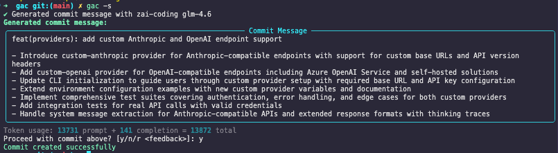

<!-- markdownlint-disable MD013 -->

# gac (Git Auto Commit)

[](https://www.python.org/downloads/)
[](docs/CONTRIBUTING.md)
[](https://github.com/psf/black)
[](https://github.com/criteria-dev/gac/actions)
[](https://app.codecov.io/gh/criteria-dev/gac)
[](LICENSE)

## Features

- **AI-Powered Commit Messages:** Automatically generates clear, concise, and context-aware commit messages using large language models.
- **Deep Contextual Analysis:** Understands your code by analyzing staged changes, repository structure, and recent commit history to provide highly relevant suggestions.
- **Multi-Provider & Model Support:** Flexibly works with various leading AI providers (like Anthropic, Groq, OpenAI) and models, easily configured through an interactive setup or environment variables.
- **Seamless Git Workflow:** Integrates smoothly into your existing Git routine as a simple drop-in replacement for `git commit`.
- **Extensive Customization:** Tailor commit messages to your needs with a rich set of flags, including one-liners (`-o`), AI hints (`-h`), commit scope (`-s`), and specific model selection (`-m`).
- **Streamlined Workflow Commands:** Boost your productivity with convenient options to stage all changes (`-a`), auto-confirm commits (`-y`), and push to your remote repository (`-p`) in a single step.
- **Reroll Capability:** Not satisfied with the generated commit message? Simply type `r` or `reroll` at the confirmation prompt to generate a new message.
- **Token Usage Tracking:** Display token consumption statistics (prompt, completion, and total tokens).

## How It Works

gac analyzes your staged changes to generate high-quality commit messages with the help of large language models.

## How to Use

```sh
git add .
gac
```



## Installation and Configuration

### 1. Installation

Install system-wide using pipx from the GitHub repository:

```sh
# Install pipx if you don't have it
python3 -m pip install --user pipx
python3 -m pipx ensurepath

# Install gac
pipx install git+https://github.com/criteria-dev/gac.git
```

Verify installation:

```sh
gac --version
```

### 2. Configuration

The recommended way to configure `gac` is using the interactive setup:

```sh
gac init
```

This command will guide you through selecting an AI provider, model, and securely entering your API keys. It will create or update a user-level configuration file at `$HOME/.gac.env`.

Example `$HOME/.gac.env` output:

```env
GAC_MODEL=anthropic:claude-3-5-haiku-latest
ANTHROPIC_API_KEY=your_anthropic_key_here
```

Alternatively, you can configure `gac` using environment variables or by manually creating/editing the configuration file.

#### Managing Configuration with `gac config`

You can manage settings in your `$HOME/.gac.env` file using `gac config` commands:

- Show config: `gac config show`
- Set a value: `gac config set GAC_MODEL groq:meta-llama/llama-4-scout-17b-16e-instruct`
- Get a value: `gac config get GAC_MODEL`
- Unset a value: `gac config unset GAC_MODEL`

### 3. Verify Setup

Test that `gac` is working properly with your configuration:

```sh
# Make a change to a file
echo "# Test change" >> README.md
git add README.md
gac -o # Generate a one-line commit message
```

You should see an AI-generated commit message.

### 4. Upgrade

To upgrade `gac` to the latest version, run:

```sh
pipx upgrade gac
```

## Basic Usage

Once installed and configured, using `gac` is straightforward:

1. Stage your changes:

   ```sh
   git add .
   ```

2. Run `gac`:

   ```sh
   gac
   ```

   This will generate a commit message for review. Confirm with `y` to accept the message.

### Common Commands

- Generate a commit message: `gac`
- Auto-accept the commit message: `gac -y`
- Stage all changes and generate a commit message: `gac -a`
- Generate a one-line commit message: `gac -o`
- Add a hint for the AI: `gac -h "Fixed the authentication bug"`
- Push the commit (requires accepting the commit message): `gac -p`
- Advanced usage: Add all, auto-confirm, push a one-liner with a hint: `gac -aypo -h "update for release"`

For a full list of CLI flags, advanced options, and example workflows, see [USAGE.md](USAGE.md).

## Best Practices

- gac loads configuration from two locations (in order of precedence):
  1. User-level `$HOME/.gac.env` (applies to all projects for the user)
  2. Project-level `.env` (in the project root, overrides user config if present) Environment variables always take final precedence over both files.
- Keep API keys out of version control
- For troubleshooting, see [docs/TROUBLESHOOTING.md](docs/TROUBLESHOOTING.md)

## Contributing

We welcome contributions! Please see [docs/CONTRIBUTING.md](docs/CONTRIBUTING.md) for guidelines.

## License

This project is licensed under the MIT License. See [LICENSE](LICENSE) for details.

## Community & Support

For questions, suggestions, or support, please open an issue or discussion on GitHub.

_Brought to you by [Criteria](https://criteria.dev)_
